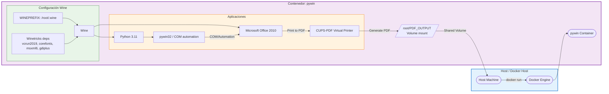

# pywin: Contenedor Docker con Wine, Office 2010 y Python 3.11

Imagen de Docker basada en `scottyhardy/docker-wine` que instala Microsoft Office 2010 (modo silencioso), Python 3.11, dependencias de `winetricks` y una impresora virtual (CUPS-PDF).

**Casos de uso**: ejecutar scripts de Python que interactúan con COM/Win32 (por ejemplo, usando `pywin32`) y generar PDFs desde aplicaciones de Office en un entorno Linux mediante Wine.

**Advertencia**: este contenedor ejecuta Wine como root y configura CUPS; úsalo únicamente en entornos controlados.

## Contenido principal del Dockerfile
- Base: `scottyhardy/docker-wine:latest`.
- Dependencias Linux: `wget`, `curl`, `cabextract`, `cups`, `cups-client`, `printer-driver-cups-pdf`.
- Configura `CUPS-PDF` para volcar PDF en `/root/PDF_OUTPUT`.
- Instala librerías Windows por `winetricks` (`vcrun2019`, `corefonts`, `msxml6`, `gdiplus`).
- Instala Microsoft Office 2010 en modo silencioso.
- Descarga e instala Python 3.11 en Wine (Directorio de instalación: `C:\Python311`).
- Instala `pip`, `setuptools`, `wheel` y `pywin32` en el entorno Wine.
- Ejecuta `pywin32_postinstall.py` y registra Excel (`EXCEL.EXE /regserver`).

## Requisitos
 - Docker (v20+ recomendado).
 - Conexión a Internet para descargar instaladores durante el build.

## Construcción (local)
Desde la carpeta que contiene el `Dockerfile`:

```bash
docker build -t pywin:latest .
```

Opcional: usar `--no-cache` si quieres forzar re-descargas:

```bash
docker build --no-cache -t pywin:latest .
```

## Ejecución (ejemplos)
Montar un directorio local para acceder a los PDF generados por `CUPS-PDF`:

En Linux/Mac:
```bash
docker run --rm -it -v /ruta/local/pdfs:/root/PDF_OUTPUT pywin:latest
```

En Windows (PowerShell):
```powershell
docker run --rm -it -v C:\ruta\local\pdfs:/root/PDF_OUTPUT pywin:latest
```

El contenedor por defecto arranca `cups` y deja el contenedor corriendo con `tail -f /dev/null`. Para ejecutar comandos dentro del contenedor (por ejemplo, abrir Excel o ejecutar un script):

```bash
docker run --rm -it -v /ruta/local/pdfs:/root/PDF_OUTPUT pywin:latest bash
```

### Dentro del contenedor (ejemplo)
wine "C:\Program Files (x86)\Microsoft Office\Office14\EXCEL.EXE" /regserver


## Variables de entorno
 - `WINEPREFIX` (por defecto: `/root/.wine`).
 - `WINEARCH` (por defecto: `win64`).
 - `WINEPATH` (incluye `C:\Python311` y `Scripts`).

Se pueden sobreescribir al crear el contenedor con `-e`. Ejemplo:

```bash
docker run -e WINEARCH=win32 -it pywin:latest
```

## Persistencia y volúmenes
Si deseas mantener el estado de Wine (instalaciones, configuraciones, Office, Python), monta un volumen en `/root/.wine`.

```bash
docker run -v /ruta/local/wineprefix:/root/.wine -it pywin:latest
```

Ejemplo: ejecutar un script Python dentro del contenedor
Montar el directorio donde quieras guardar los PDFs y ejecutar el contenedor:

```bash
docker run --rm -it -v /ruta/local/pdfs:/root/PDF_OUTPUT pywin:latest bash
# Dentro del contenedor:
python C:\ruta\a\tu_script.py
```

El script podría automatizar Excel vía COM con `pywin32` y luego imprimir a la impresora virtual (CUPS-PDF),
leyendo el PDF resultante desde el host en `/root/PDF_OUTPUT`.

## Notas y solución de problemas
- El build descarga instaladores desde GitHub y python.org; si cambian los URLs, el build podría fallar.
- Si necesitas depurar GUIs, considera ejecutar con un servidor X o exponer `DISPLAY`; el Dockerfile incluye `xvfb-run` para instalaciones silenciosas.
- `CUPS-PDF` genera archivos PDF en `/root/PDF_OUTPUT`; si no los ves, comprueba permisos y que el servicio CUPS esté activo.

## Referencias
- Para más información sobre la configuración de Office y recursos relacionados, revisa: https://github.com/xeden3/docker-office-python-core — la configuración de Office en este `Dockerfile` se basó en ese repositorio.

## Licencia
Este repositorio no incluye binarios con licencia; las instalaciones de Office y Python están sujetas a sus respectivas licencias.

## Autor
- Archivo generado por el usuario; revisa el `Dockerfile` para más detalles.

--
Si quieres, puedo: añadir ejemplos de scripts, agregar entradas para `docker-compose`, o mejorar las secciones de troubleshooting. ¿Qué prefieres que haga después?

## Diagrama de arquitectura
Este diagrama muestra el flujo de ejecución y los componentes principales: host, Docker, contenedor pywin, Wine, Office y Python, y cómo los PDFs generados por CUPS-PDF son volcados en un volumen.




### Renderizar el diagrama localmente
Si quieres generar una imagen del diagrama puedes usar `@mermaid-js/mermaid-cli`:

```bash
npm install -g @mermaid-js/mermaid-cli
mmdc -i diagrams/architecture.mmd -o diagrams/architecture.png
```

O usa el editor online: https://mermaid.live para pegar el contenido de `diagrams/architecture.mmd`.

